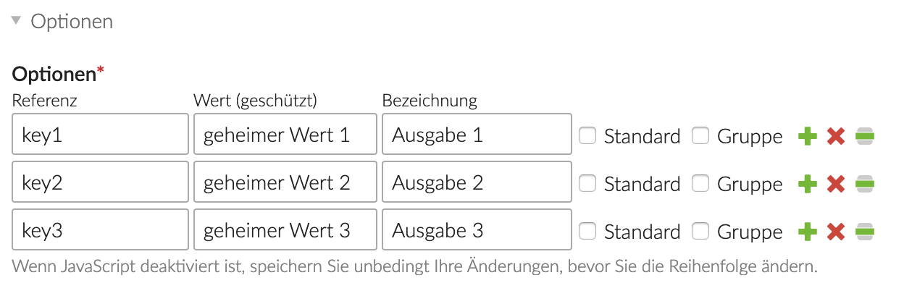
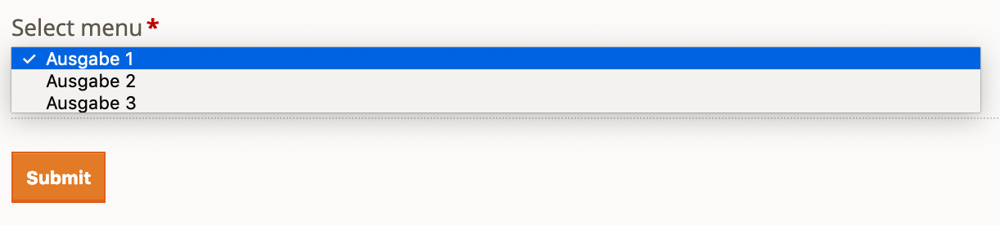

# protectedselect Contao extension

## Geschütztes Select-Menü

Stellt ein Select-Menu für Formulare bereit, deren Klartextwerte nicht im Frontendformular angegeben sind.

## Protected select menu

Adds a new form select widget which hides the internal field values in the front end.

## Screenshot

**Backend form**

**Backend form**

